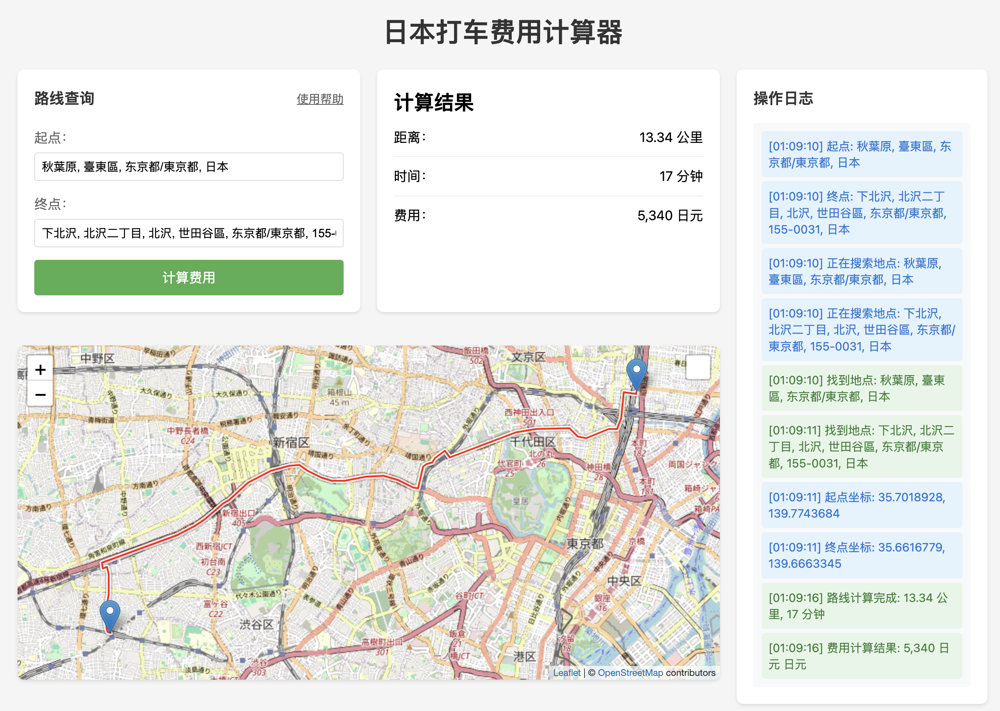

# 日本打车费用计算器



[](https://www.python.org/downloads/)
[](LICENSE)
[](https://github.com/astral-sh/uv)
[](https://cursor.sh)

这是一个基于 Web 的日本打车费用计算应用，具有交互式地图界面，可以计算任意两点之间的打车费用。

> **特别说明**：本项目完全由 [Cursor](https://cursor.sh) 通过 vibe coding 生成，没有手写任何一行代码。这展示了 AI 辅助编程的强大能力。

## 目录

- [功能特点](#功能特点)
- [技术栈](#技术栈)
- [安装步骤](#安装步骤)
- [使用说明](#使用说明)
- [费用计算规则](#费用计算规则)
- [注意事项](#注意事项)
- [界面说明](#界面说明)
- [开发说明](#开发说明)
- [贡献指南](#贡献指南)
- [安全策略](#安全策略)
- [许可证](#许可证)

## 功能特点

- 交互式地图界面（基于 OpenStreetMap）
- 实时操作日志显示
- 地点自动搜索和模糊匹配（限制在日本境内）
- 实时路线显示
- 费用计算（基于距离和时间）
- 响应式设计
- 直观的用户界面
- 智能地点推荐（支持中文、日文和英文输入）

## 技术栈

- 后端：Python Flask
- 前端：HTML, CSS, JavaScript
- 地图服务：OpenStreetMap + Leaflet.js
- 路线规划：OSRM（Open Source Routing Machine）
- 地理编码：Nominatim
- 包管理：uv

## 安装步骤

1. 克隆项目到本地
2. 安装 uv（如果尚未安装）：
   ```bash
   curl -LsSf https://astral.sh/uv/install.sh | sh
   ```
3. 创建并激活虚拟环境：
   ```bash
   # 创建虚拟环境
   uv venv
   
   # 在 Unix/macOS 上激活虚拟环境
   source .venv/bin/activate
   
   # 在 Windows 上激活虚拟环境
   .venv\Scripts\activate
   ```
4. 使用 uv 安装依赖：
   ```bash
   uv pip install -r requirements.txt
   ```
5. 运行应用：
   ```bash
   python app.py
   ```

## 使用说明

1. 在起点和终点输入框中输入或选择地点
   - 支持中文、日文和英文输入
   - 输入时会自动显示相关地点建议
   - 点击建议项可快速选择
   - 例如：东京站、涩谷站、新宿站等

2. 点击"计算费用"按钮
   - 系统会自动搜索地点
   - 在地图上显示路线
   - 计算预计费用
   - 实时显示操作日志

3. 查看结果
   - 地图上显示路线
   - 显示距离、时间和费用信息
   - 右侧面板显示详细的操作日志

## 费用计算规则

- 基础费用：410 日元（1.052 公里以内）
- 后续每 237 米加收 80 日元
- 等待时间费用：每 1 分 45 秒加收 80 日元
- 夜间附加费（22:00-05:00）：20%

## 注意事项

- 费用计算基于东京地区的标准费率
- 实际费用可能因交通状况、时间等因素有所不同
- 地理编码服务有使用限制，建议在实际生产环境中使用自己的地理编码服务
- 路线规划可能不如商业地图服务精确，但基本功能都能满足需求
- 地点搜索功能使用防抖处理，输入后会有短暂延迟

## 界面说明

- 左侧面板：
  - 地点搜索框（带智能推荐）
  - 费用计算结果
  - 使用提示
  - 交互式地图

- 右侧面板：
  - 实时操作日志
  - 显示所有操作的状态和结果

## 开发说明

- 前端日志系统使用自定义的 `logMessage` 函数
- 地理编码限制在日本境内（countrycodes=jp）
- 使用 OSRM 的演示服务器进行路线规划
- 地点搜索使用防抖处理，延迟300毫秒
- 搜索结果按重要性排序，最多显示5个结果
- 所有 API 调用都有错误处理和用户提示

## 贡献指南

请查看 [CONTRIBUTING.md](CONTRIBUTING.md) 了解如何为项目做出贡献。

## 安全策略

请查看 [SECURITY.md](SECURITY.md) 了解项目的安全策略。

## 许可证

本项目采用 MIT 许可证 - 详情请参阅 [LICENSE](LICENSE) 文件。 